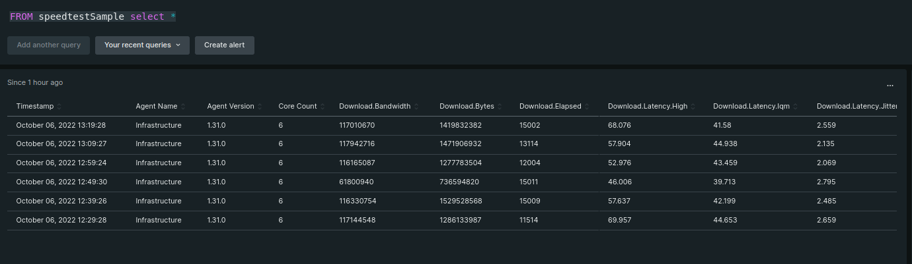

This will be a continuation on my series of "Absolutely Simple" monitoring, focusing on gathering metrics that may not be included with [pre-built agents and quick starts](https://developer.newrelic.com/contribute-to-quickstarts/build-a-quickstart/).

In my [last post](!!LINK!!) I introduced [Ookla's internet speed test command line utility](https://www.speedtest.net/), and showed you how to pick up the latency, download bps, and upload bps statistics through the use of a python script.

Eagle-eyed readers may have noticed a tantalizing element of the command we tested with:

	speedtest --accept-license -f csv

That `-f csv` (format the output for CSV) implies other formats. And indeed, if you involk the help option (`-h`) you see that multiple output formats are supported:

Those formats include csv, tsv, json, jsonl, and json-pretty. 

#All the cool kids use JSON

It just so happens that the Flex integration automatically ingests and proceses JSON information. And since so many tools and techniques we IT practitioners use - from external APIs to internal utilities - have adopted JSON as one of their output options, I thought it was worth re-visiting this example and re-implementing it with a JSON twist. 

In the case of our example, speedtest's JSON output looks like this:

	{"type":"result","timestamp":"2022-10-06T16:01:24Z","ping":{"jitter":0.437,"latency":36.504,"low":35.844,"high":36.886},"download":{"bandwidth":117938053,"bytes":1470439610,"elapsed":15005,"latency":{"iqm":43.484,"low":35.123,"high":64.032,"jitter":2.269}},"upload":{"bandwidth":5125601,"bytes":47343420,"elapsed":9409,"latency":{"iqm":32.715,"low":31.482,"high":133.830,"jitter":1.604}},"packetLoss":0,"isp":"Spectrum","interface":{"internalIp":"192.168.101.116","name":"enp0s31f6","macAddr":"B4:45:06:69:92:03","isVpn":false,"externalIp":"174.100.204.122"},"server":{"id":51155,"host":"speedtest-bd-1.zoominternet.net","port":8080,"name":"Armstrong Cable","location":"North Lima, OH","country":"United States","ip":"72.23.2.122"},"result":{"id":"5246f9b4-d5dd-4205-8ea2-427bcdda747a","persisted":false}}

#Getting set up
To quickly review: 

 * You have [a New Relic account](https://one.newrelic.com) (the free one will work fine!).
 * You've installed the New Relic infrastructure agent as described in [my first blog post about Flex](!!LINK!!).
 * You've installed the Ookla speedtest utility from [here](https://www.speedtest.net/apps/cli).

#[YAML lama ding dong](https://www.youtube.com/watch?v=f3gIid5pHlc)

With those particulars out of the way, we're ready to set up our YAML file in /etc/newrelic-infra/integrations.d (or C:\Program Files\New Relic\newrelic-infra\integrations.d if you're testing this on a Windows system). 

	integrations:
	  - name: nri-flex
	    timeout: 5m
	    interval: 1h
	    config:
	      name: linuxspeedtest 
	      apis:
	        - name: speedtest
	          commands:
	            - run: speedtest --accept-license -f json
	              timeout: 300000
	          remove_keys:
	            - timestamp

In many ways, this version is much simpler than the script-based version I showed you first. Let me call out some of the key elements of this yaml file:

    interval: 1h
As with the script-based version, we don't want to saturate our bandwidth with tests every few minutes, so setting the interval to once per hour seems reasonable. Feel free to "salt to taste".

    - run: speedtest --accept-license -f json

The actual command we're running, with json specified (not jsonl* or jason-pretty)

    timeout: 300000

As with the script-based version of this monitor, running speedtest takes more than the default 30 seconds, so we need to extend the running time to allow for it. 5 minutes (500000 milliseconds) worked fine in my tests.

    remove_keys:
      - timestamp

If you look back at the sample JSON output, you'll notice one of the first items is a timestamp. Left in place, this could conflict with New Relic's internal time marker during ingest, so we're better off removing it using the `remove_keys` function.

For details on supported YAML functions (like the `remove_keys` option you see above) check out [our document on data parsing and transformation functions](https://github.com/newrelic/nri-flex/blob/master/docs/basics/functions.md). For more information on other commands and switches, check out [the documentation on Flex YAML options](https://docs.newrelic.com/docs/infrastructure/install-infrastructure-agent/configuration/infrastructure-agent-configuration-settings/).

(... <-remove these so we keep the footnote)  * No, I didn't know what "JSONL" format was either. But running it once showed me quickly - it's a List of each test as it executes. Great for tracking progress, not so good for metric collection.

#Now for the NRQL

Once your YAML file is set up and running, data should be flowing into your New Relic account. To see it, let's start again with the very high-level query:

	FROM speedtestSample select *

That will show you all of the JSON information we're collecting:

Scrolling right you'll find values for Download.Bandwidth, Download.Bytes, Download.Latency, Upload.Bandwidth, and more. Which should be everything you need, with one hitch: In the script based version of this monitor, we were able to divide the download number by 125,000 to get the bits per second (bps) value before presenting that output to New Relic for ingest. 

In this case, because we're taking the unprocessed JSON data, we'll have to post-process it. Therefore, our final NRQL query will look like this:

	FROM speedtestSample select average(download.bandwidth)/125000, average(upload.bandwidth)/125000 TIMESERIES

That query, when turned into a chart, makes a lovely addition to the a system's dashboard:

1[bandwidth statistics along with other system metrics on a dashboard](JSON_dashboard.png)